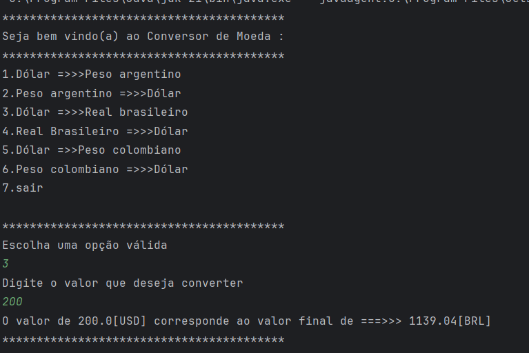

# Conversor de Moedas



## Descrição do projeto :

* O conversor de moedas  é uma aplicação 
Java que permite ao usuário converter valores entre 
diferentes moedas de forma prática e interativa,
diretamente pelo terminal. Utilizando a API pública ExchangeRate, 
o sistema realiza consultas em tempo real e exibe o resultado 
da conversão com base na taxa de câmbio atual.
* O projeto foi desenvolvido com foco na
prática de consumo de APIs, tratamento de entrada de dados,
organização em pacotes e uso de bibliotecas externas 
como o Gson para manipulação de JSON.

## Funcionalidades :
* Interface via terminal
* Uso de api externa Exchangerate-API
* Interação com usuário
* Exibição clara da conversão de valores

## Tecnologias : 


## Como baixar o projeto :

Você pode clonar este repositório usando Git. Siga os passos abaixo:

```bash
# Clone o repositório
git clone https:https://github.com/Maridev08/conversordemoeda.git

# Acesse a pasta do projeto
cd conversordemoeda
# Baixe o Gson no seu computador 
https://mvnrepository.com/search?q=Gson

